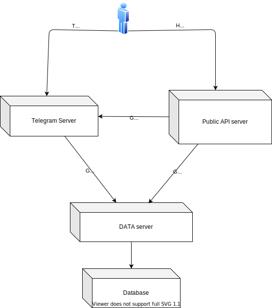

# GoMoney 
[](https://godoc.org/github.com/lordvidex/gomoney)
[](https://goreportcard.com/report/github.com/lordvidex/gomoney)
[](https://coveralls.io/github/lordvidex/gomoney?branch=main)

## About GoMoney
GoMoney is a project that aims to provide an intuitive
 and easy to use solution for managing funds and accounts.
 
 Users can create multiple accounts and log fund transfers between these accounts. It is also possible to access accounts from various platforms

## Contents


The GoMoney library contains the following subpackages:
- Telegram server
- REST API server 
- Data server

### Telegram server [/telegram](/telegram)

The telegram server is a simple telegram bot that allows users to interact with the GoMoney API. It is written in Go and uses the [telego library](https://github.com/SakoDroid/telego).

### REST API server [/api](/api)

REST API server makes the GoMoney service accessible to other application via a REST API. 

### Data server [/server](/server)

Data server is responsible for handling all the interactions with the database.


## Build project 
To build the docker image first set the env vars or use the default values by using the following command
```bash
cp .env.example .env
cp .db.env.example .db.env
```

Then build the docker image using the following command
```bash
docker-compose up
```

## RoadMap
- [x] Build basic structure around hexagonal architecture
- [x] Complete Account implementation on grpc server
- [x] Complete telegram bot with functions
- [x] Complete REST API
- [x] Host the application
